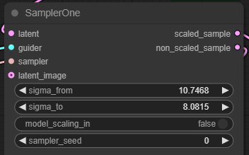
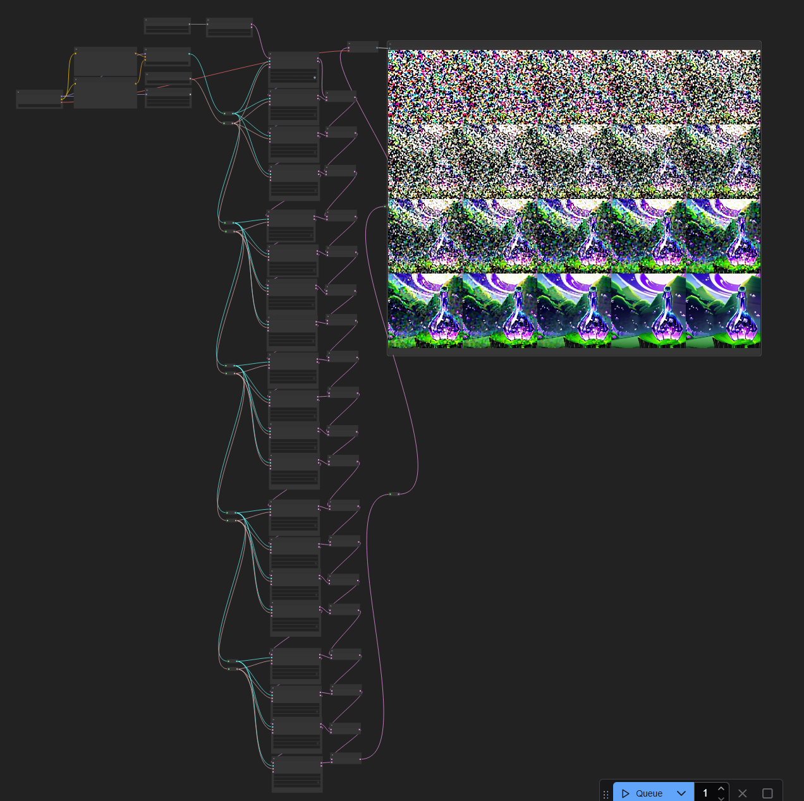

# ComfyUI-SamOne - one-step sampling

ComfyUI でサンプリングを1ステップだけ進めるノードです。

ノードは `hnmr/samone` 以下に追加されます。

## Nodes

### SamplerOne

サンプリングを1ステップだけ進めるノードです。

| in/out | name | type | Description |
| --- | --- |--- | --- |
| in | latent | LATENT | noisy latent を入れてください |
| in | guider | GUIDER | CFGGuider とかそういうやつです |
| in | sampler | SAMPLER | KSamplerSelect の出力を入れてください |
| in | sigma_from | FLOAT | ステップの σ を入れてください（時刻ではないので注意）|
| in | sigma_to | FLOAT | 次ステップの σ を入れてください（時刻ではないので注意）|
| in | model_scaling_in | BOOLEAN | 初期ステップでは True にしてください |
| in [opt] | latent_image | LATENT | i2i のときに使います |
| in [opt] | sampler_seed | INT | サンプラがシードを取るときに使います |
| out | scaled_sample | LATENT | VAE に通せるようスケーリングした出力です |
| out | non_scaled_sample | LATENT | 次のサンプリングに使うためのスケーリングしていない出力です |

### Latent

`shape` を文字列で与えて noisy latent を生成する便利ノードです。

## Example workflow

[sample workflow (JSON)](./assets/SamOneTest.json)

